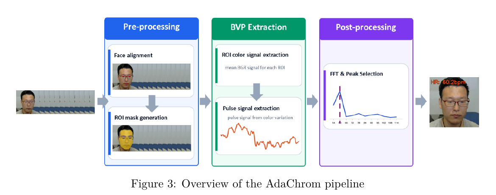

<div align="center">

# HERTZ


### 面向人脸视频的开源心率估计算法集合

HERTZ 将多种互补的心率估计方法组织为可扩展的开源算法集合。TinyHR 从人脸视频学习脉搏波形，
AdaChrom 则通过无需训练的色度信号处理管线恢复脉搏信号。

[English](README.md) | [简体中文](README_CN.md)

[HERTZ 项目主页](https://seetapsych.github.io/seetapsych-hertz/zh/)

[项目简介](#项目简介) · [算法集合](#hertz-心率估计算法集合) · [安装](#安装) · [演示](#演示) · [数据集](#训练数据) · [性能测试](#模型规模与推理时间) · [资源](#项目资源)

[](https://raw.githubusercontent.com/seetapsych/seetapsych-hertz/main/website/public/media/demo-full.mp4)

*观看 TinyHR 从人脸视频估计脉搏波形与心率；点击可观看完整演示。*

[](https://github.com/seetapsych/seetapsych-hertz/blob/main/pyproject.toml)
[](https://github.com/seetapsych/seetapsych-hertz/blob/main/seetapsych_hertz/modules/tiny-hr.yml)
[](https://github.com/seetapsych/seetapsych-hertz/blob/main/seetapsych_hertz/modules/tiny-hr.yml)
[](https://github.com/seetapsych/seetapsych-hertz/blob/main/LICENSE)

</div>

## 项目简介

HERTZ 为
[SeetaPsych](https://github.com/seetapsych/seetapsych-lib) 生态提供心率估计模块。
项目包含两种开源的远程光电容积描记（rPPG）心率估计方案：**TinyHR** 是从人脸视频预测
脉搏波形的轻量级卷积模型；**AdaChrom** 是基于自适应皮肤区域筛选、色度投影与
频谱分析的无监督信号处理方法。

导出的 ONNX 模型包含 **82,177 个参数元素**，文件大小约 **381 KiB**。
报告中四个数据集的训练子集计数合计为 **1,288 名受试者、6,307 段视频**。
流式模块采用 160 帧输入窗口，收集足够的有效人脸帧后，默认以 1.0 秒间隔请求更新。

## 核心优势

| | 特性 | 实际价值 |
|---|---|---|
| 🌍 | **多来源训练数据** | 四个 rPPG 数据集的训练子集合计 1,288 名受试者、6,307 段视频，涵盖多种采集条件。 |
| 🪶 | **紧凑卷积模型** | 约 8.2 万个导出参数、381 KiB 的 ONNX 文件，降低边缘部署的模型存储需求。 |
| ⚡ | **快速模型推理** | 100 次参考测试中，Intel Core i9-13900KF CPU 平均 80 ms，NVIDIA H20 GPU 平均 6 ms。 |
| 📹 | **非接触式测量** | 使用普通 RGB 摄像头采集人脸视频，估计过程不依赖穿戴式传感器。 |
| 📈 | **基于波形的心率估计** | 模型预测 rPPG 波形，再经信号处理估计心率；预测波形可供进一步分析。 |
| 🧩 | **集成 SeetaPsych** | 已提供可用于视频文件和实时视频流的 SeetaPsych 模块配置。 |

## 核心数据

| 训练数据集 | 训练受试者（合计） | 训练视频 | ONNX 参数量 | 模型大小 | VIPL-HR V1 测试 MAE |
|---:|---:|---:|---:|---:|---:|
| **4** | **1,288** | **6,307** | **82,177** | **381 KiB** | **3.88 BPM** |

## 演示

演示画面同时显示检测到的人脸、预测的 rPPG 波形与心率估计。该视频用于说明处理流程；
模型精度请参见下文实验结果。

## 训练数据

TinyHR 使用四个 rPPG 数据集的子集训练。下表依据技术报告列出实际使用的训练数据，
并补充合计行；这些数量不代表各原始数据集的完整规模。

| 数据集 | 训练受试者 | 训练视频 | 用途 |
|---|---:|---:|---|
| VIPL-HR V1 | 85 | 1,883 | 训练 |
| VIPL-HR V2 | 500 | 2,498 | 训练 |
| V4V | 103 | 726 | 训练 |
| MCD-rPPG | 600 | 1,200 | 训练；仅使用正脸视频 |
| **合计** | **1,288** | **6,307** | **四来源训练数据** |

VIPL-HR V1 测试集包含 **22 名受试者和 485 段视频**，报告说明该测试集未参与训练。
上表受试者合计为四个训练子集所报告人数的算术和。

| 训练配置 | 设置 |
|---|---|
| 批大小 | 4 |
| 初始学习率 | 0.005 |
| 学习率调度器 | OneCycleLR |
| 输入视频片段 | 160 帧 RGB 人脸裁剪图像，每帧缩放至 128 × 128 像素 |

来源：[TinyHR 技术报告](https://raw.githubusercontent.com/seetapsych/seetapsych-hertz/main/website/public/downloads/tinyhr-technical-report.pdf)，第 1 页（模型输入）、第 6-7 页（训练数据与配置）。

## 模型规模与推理时间

| 测试项 | 结果 | 说明 |
|---|---:|---|
| 导出 ONNX 参数量 | **82,177** | 导出及卷积与归一化融合后的初始化张量元素数，不等同于导出前的可学习参数量 |
| ONNX 文件大小 | **约 381 KiB** | 390,150 字节；SHA-256 与 `tiny-hr.yml` 声明的校验值一致 |
| CPU 推理时间 | **平均 80 ms** | Intel Core i9-13900KF（3.00 GHz）上进行 100 次 TinyHR 推理 |
| GPU 推理时间 | **平均 6 ms** | 服务器 NVIDIA H20 GPU 上进行 100 次 TinyHR 推理 |
| 输入观测时长 | **30 FPS 时约 5.3 秒** | 收集 160 帧有效人脸图像所需时间；首个结果还受更新调度与计算耗时影响 |
| 滚动更新间隔 | **默认 1.0 秒** | 按时间戳请求更新；30 FPS 时每个间隔约含 30 帧 |

**测量范围。** 以上为项目提供的参考数据，每台设备分别运行 100 次 TinyHR 模型推理。
计时不包含视频采集、人脸检测、160 帧输入窗口收集和更新调度。测试未记录具体运行时配置，
结果会随硬件及运行环境变化，并与模型精度评估分别统计。

160 帧输入、计算耗时与更新间隔分别描述不同环节。流式实现累积最长约 20 秒的预测波形
用于心率估计，因此 1.0 秒更新间隔不等同于对生理变化的 1.0 秒响应。
紧凑模型与滚动估计适用于人机交互、情感计算和非接触式监测研究的原型开发。

## HERTZ 心率估计算法集合

### TinyHR：轻量学习型 rPPG

[](https://raw.githubusercontent.com/seetapsych/seetapsych-hertz/main/website/public/downloads/tinyhr-flowchart.pdf)

*点击图片可打开架构 PDF。图中部分标签与报告正文不一致：TinyHR 采用卷积式 MTF 时序处理与非重叠空间分块，具体说明见下表。*

| 阶段 | 模块 | 功能 |
|---:|---|---|
| 01 | 帧差融合 Stem | 将四组相邻帧 RGB 差分拼接为 12 通道，仅通过差分分支提取特征，未启用原始 RGB 外观分支。 |
| 02 | 空间 Patch Embedding | 逐帧采用核大小与步幅均为 4 的二维卷积，以非重叠分块将 32 × 32 特征映射为 32 通道的 8 × 8 网格，保留时间分辨率。 |
| 03 | 多尺度时序特征（MTF）块 | 空间增强与全局平均池化后，经四个并行时间移位分支、逐点卷积和时序前馈网络处理，再通过残差连接融合特征。 |
| 04 | 波形预测头 | 空间全局平均池化后，通过两层逐点卷积为每帧输出一个 rPPG 采样值，保留 160 帧的时间分辨率。 |
| 05 | 信号处理 | 当前实现对预测波形去趋势、带通滤波，再由 Welch PSD 主峰估计心率；流式模式使用最长约 20 秒的累积波形。 |

推理阶段采用截止频率为 0.75 和 2.5 Hz 的 Butterworth 带通滤波器（对应 45-150 BPM），
在这一配置的搜索频带内，取 Welch PSD 最大峰值对应的频率计算心率：

```text
心率（BPM）= 60 × 主频（Hz）
```

技术报告定义了三项训练目标：负 Pearson 相关系数（`L_time = -ρ`）约束时域波形一致性；
交叉熵（`L_CE`）对 45-149 BPM 范围内的离散心率类别进行分类，以参考血容量脉搏（BVP）
信号的频谱主峰所属类别作为监督；KL 散度（`L_KL`）约束分别以参考与预测频谱主峰为中心的高斯分布。
三项权重依次为 0.2、1.0 和 1.0：

```text
L = 0.2 L_time + L_CE + L_KL
```

### AdaChrom：无监督色度 rPPG

AdaChrom 是一种从人脸视频估计心率的无监督远程光电容积描记方法。该方法无需使用
带标签的训练数据，而是利用面部皮肤区域细微的时序颜色变化，估计与脉搏相关的血容量
脉搏（BVP）信号，为非接触式心率估计提供可解释的技术方案。对于给定的人脸视频序列，
AdaChrom 依次执行三个阶段：预处理阶段完成人脸对齐并生成感兴趣区域（ROI）掩膜；
BVP 提取阶段在滑动时间窗口内计算有效面部区域的平均 BGR 颜色信号，并由这些时序颜色
信号恢复 BVP；后处理阶段通过频域分析与峰值选择，从恢复的 BVP 信号中估计心率。



*AdaChrom 信号处理流程。*

#### A. 预处理

预处理阶段为基于 ROI 的信号提取建立可靠的空间支撑。具体而言，首先对齐面部关键点，
以减小运动引起的 ROI 偏移；随后生成 ROI 掩膜，确定有效的面部皮肤区域，供后续 BVP
信号提取使用。

##### i) 人脸对齐

人脸对齐为后续所有 ROI 操作提供几何基础。对齐后的关键点也用于检查每一帧的有效性；
若某一帧的关键点坐标缺失、为零或包含非有限数值，则将该帧从当前估计窗口中排除。
人脸对齐的具体方法参见 SeetaPsych Face Hub。

##### ii) ROI 掩膜生成

完成对齐后，根据面部关键点定义多边形区域，并由此构建面部 ROI 掩膜，以分离皮肤占主导
的面部区域。随后在 YCrCb 颜色空间中施加肤色约束，取几何人脸掩膜与肤色检测掩膜的
交集作为最终 ROI 掩膜。对于每个有效 ROI，算法同时记录平均 BGR 值和有效像素数量，
从而在信号估计前排除空 ROI 或可靠性不足的 ROI。当前实现支持以下四种 ROI 策略。

**传统 YCrCb 皮肤 ROI（AdaChrom-v1）：** 首先依据面部关键点构建完整人脸掩膜，
随后采用固定的 YCrCb 肤色规则，在人脸区域内识别皮肤像素。

**固定前额种子皮肤 ROI（AdaChrom-v2）：** 采用预定义的、基于关键点的前额区域作为
肤色建模的种子区域。利用种子像素在 Cr/Cb 颜色空间中拟合二维高斯模型；当人脸区域内
像素的颜色分布与学习得到的前额皮肤模型足够接近时，保留该像素。

**自适应前额种子皮肤 ROI（AdaChrom-v3）：** 在估计 Cr/Cb 肤色模型之前，对前额周围
的种子区域进行扩展。相较于固定前额种子，该策略能够纳入更多可靠的前额皮肤像素；
当固定种子区域过小，或局部关键点变化对其造成影响时，可提高 ROI 提取的稳健性。

**连通分量筛选皮肤 ROI（AdaChrom-v4）：** 在自适应前额策略的基础上，进一步依据
空间连通性筛选候选皮肤区域。算法去除孤立的假阳性区域，并保留与面部皮肤区域在空间上
一致的较大连通分量，用于后续 BGR 信号提取。

#### B. BVP 提取

BVP 提取阶段将面部 ROI 中的空间颜色观测转换为时序颜色轨迹，并从中恢复与脉搏相关的
BVP 信号。该阶段在滑动时间窗口内汇聚有效 ROI 的测量结果，形成后续心率估计所需的
信号表示。

##### i) ROI 颜色信号提取

对于每个有效帧及其 ROI，算法计算 ROI 掩膜内 BGR 像素值的空间均值：

$$
c_t = [\overline{B_t}, \overline{G_t}, \overline{R_t}]
$$

由此可为每个 ROI 获得一条时序颜色轨迹。远程光电容积描记依赖血容量变化引起的细微
皮肤颜色变化，因此采用空间平均抑制像素级噪声，同时保留占主导地位的时序变化。

在提取脉搏信号之前，算法根据帧时间戳，将不规则采样的颜色观测重采样至等间隔时间网格。
随后对信号进行平滑以降低高频噪声，并以各通道的时序均值进行归一化，以减弱光照尺度
变化的影响。

##### ii) 脉搏信号提取

BVP 提取的核心模型采用 CHROM 色度投影。首先将归一化后的 RGB 轨迹变换为两个色度分量：

$$
X = 3R - 2G
$$

$$
Y = 1.5R + G - 1.5B
$$

随后依据两个分量的时序标准差对其进行平衡，并计算脉搏信号：

$$
\alpha = \frac{std(X)}{std(Y)}
$$

$$
s(t) = X - \alpha Y
$$

该投影突出与血容量脉搏相关的颜色变化，同时抑制光照变化及运动导致的强度变化。
在频谱分析之前，进一步对投影得到的 BVP 信号进行去均值、尺度调整和平滑处理。

#### C. 后处理

后处理阶段通过基于快速傅里叶变换（FFT）的频谱分析和峰值选择，将提取的 BVP 信号转换为
最终心率估计。执行实值 FFT 之前，先施加汉明窗（Hamming window）以减小频谱泄漏；随后在估计器的
有效心率范围内（约 50–120 BPM）搜索幅度谱，选择占主导地位的谱峰作为心率频率，并将其
换算为每分钟心搏次数。

$$
f_{peak} = \underset{f}{\arg\max}\, |FFT(s(t))|
$$

$$
HR = 60 f_{peak}
$$

## 实验结果

| 数据集 | 测试集 | 实验方案 | MAE |
|---|---|---|---:|
| VIPL-HR V1 | 22 名受试者 · 485 段视频 | 留出测试集，未参与训练 | **3.88 BPM** |

技术报告在该留出测试集上报告的心率平均绝对误差（MAE）为 3.88 BPM。
该结果反映此评估方案下的性能，不能据此推断跨数据集泛化能力或临床测量精度。

## 安装

本项目已包含在 SeetaPsych 默认配置中，可通过以下命令下载模块：

```bash
seetapsych-manager download
```

完整框架使用方法请参见
[SeetaPsych](https://github.com/seetapsych/seetapsych-lib)。

## 使用方法

### WebUI

```bash
seetapsych-webui --files seetapsych_hertz/modules/tiny-hr.yml
```

### 代码调用

```python
from seetapsych_lib.runtime.factory import Factory
from seetapsych_lib.runtime.pipeline import Pipeline

factory = Factory()
factory.load_file_modules("seetapsych_hertz/modules/tiny-hr.yml")

pipeline = Pipeline(factory, ...)
pipeline.add_attributes("face/heart_rate")
```

完整的端到端可视化示例请参见：

* [examples/camera_heart_rate.py](https://github.com/seetapsych/seetapsych-hertz/blob/main/examples/camera_heart_rate.py) — 摄像头实时 rPPG 心率估计，带滚动 BPM 读数。

## 模块库

| 模块 | 说明 | 输入方式 |
|---|---|---|
| [AdaChrom](https://github.com/seetapsych/seetapsych-hertz/blob/main/seetapsych_hertz/modules/ada-chrom.yml) | 基于自适应皮肤 ROI 的色度 rPPG 方法，脉搏估计不依赖学习模型 | 视频流 · 视频文件 |
| [TinyHR](https://github.com/seetapsych/seetapsych-hertz/blob/main/seetapsych_hertz/modules/tiny-hr.yml) | 卷积式 rPPG 波形估计，结合基于 Welch PSD 的心率后处理 | 视频流 · 视频文件 |

### TinyHR 参数

| 名称 | 类型 | 默认值 | 说明 |
|---|---|---:|---|
| `fps` | number | `30` | 用于波形缓冲与频谱分析的采样率，应与有效输入帧率一致 |
| `interval` | number | `1` | 按时间戳触发的更新请求间隔，单位为秒；区别于观测时长与计算耗时 |

### AdaChrom

> 基于自适应皮肤 ROI 的色度分析实现无模型 rPPG 心率估计。

模块配置：[ada-chrom.yml](https://github.com/seetapsych/seetapsych-hertz/blob/main/seetapsych_hertz/modules/ada-chrom.yml)

| 包 | 提供 | 依赖 |
|---|---|---|
| HeartRate-AdaChrom | `face/heart_rate` | `face/dense_landmarks` |

**说明**

基于自适应额头 ROI 的色度 rPPG 心率估计器，无需神经网络模型。

**使用说明**

- 同时支持视频流与视频文件输入。
- 视频流模式下，30 FPS 或更高帧率可获得最佳效果，需优化处理逻辑与更好的硬件（GPU）。
- 为获得稳定的分析结果，推荐使用帧率稳定在 30 FPS 或以上的视频文件。

**参数**

| 名称 | 类型 | 默认值 | 说明与调优 |
|---|---|---|---|
| `window_samples` | integer | `300` | 心率估计的滑动窗口帧数。数值越大噪声越低但延迟越高；需根据实时性需求调整。 |
| `roi_regions` | `selection[]` | `["skin_b_adaptive_forehead"]` | 用于心率估计的区域列表。默认为 `["skin_b_adaptive_forehead"]`。多个选择器独立计算，有效结果融合至 `hr_bpm`，各区域独立结果保存在 `roi_hr_bpm` 映射中。 |

**模型**

*(无)*

**输出属性**

- `face/heart_rate` — [规格说明](https://github.com/seetapsych/seetapsych-attributes#faceheart_rate)。

通过 `roi_regions` 请求的各区域结果返回在 `roi_hr_bpm` 中：每个键对应一个选中的 ROI，值为该区域在当前窗口内的心率（BPM）。

## 项目资源

- [完整演示视频](https://raw.githubusercontent.com/seetapsych/seetapsych-hertz/main/website/public/media/demo-full.mp4)
- [TinyHR 技术报告](https://raw.githubusercontent.com/seetapsych/seetapsych-hertz/main/website/public/downloads/tinyhr-technical-report.pdf)
- [模型架构图](https://raw.githubusercontent.com/seetapsych/seetapsych-hertz/main/website/public/downloads/tinyhr-flowchart.pdf)
- [HERTZ 项目主页](https://seetapsych.github.io/seetapsych-hertz/zh/)
- [交互式项目主页源码](https://github.com/seetapsych/seetapsych-hertz/tree/main/website)
- Hugging Face 模型发布与交互式演示正在规划中。

## 开源许可

本项目使用 [BSD 3-Clause License](https://github.com/seetapsych/seetapsych-hertz/blob/main/LICENSE) 发布。

## 项目机构

<p align="center">
  <a href="https://mysee1989.github.io/" title="东南大学"></a>
  &nbsp;&nbsp;&nbsp;&nbsp;&nbsp;&nbsp;
  <a href="https://vipl.ict.ac.cn/" title="中国科学院计算技术研究院"></a>
</p>
